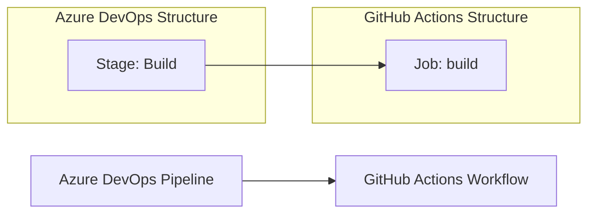

# 🚀 Azure DevOps to GitHub Actions Migration Report

## 📊 Migration Overview

| Metric | Before (Azure DevOps) | After (GitHub Actions) |
| --- | --- | --- |
| Pipeline Files | 1 file | 1 workflow |
| Pipeline Stages | 1 stage | 1 job |
| Pipeline Jobs | 1 job | 1 job |
| Templates | 0 templates | Expanded inline |

## 🔄 Conversion Diagram



## 🔧 Key Transformations

### Stage/Job Conversions

- Azure DevOps stage → GitHub Actions job
- Azure DevOps tasks → equivalent GitHub Actions setup and shell steps
- Azure pipeline variables → GitHub Actions environment variables
- Windows-latest pool → `runs-on: windows-latest`

### Task and Variable Mappings

- `NodeTool@0` → `actions/setup-node@v6.4.0`
- `UseDotNet@2` → `actions/setup-dotnet@v5.4.0`
- `Npm@1` → `npm install` in the ClientApp folder
- `DotNetCoreCLI@2` restore/build/test → `dotnet restore`, `dotnet build`, and conditional `dotnet test`

## ✅ Validation Results

### Linting Results

```
$ actionlint .github/workflows/tailwindtraders-build.yml
```

No output was produced and the command exited successfully.

### Build Verification

```
$ dotnet restore TailwindTraders.Website/Source/Tailwind.Traders.Web/Tailwind.Traders.Web.csproj
$ dotnet build TailwindTraders.Website/Source/Tailwind.Traders.Web/Tailwind.Traders.Web.csproj --configuration Release --no-restore
```

Restore completed successfully and the project built successfully with 0 errors and 15 warnings.

### Manual Verification Checklist

- [x] YAML syntax validated
- [x] All actions properly versioned
- [x] Job dependencies verified
- [x] Environment variables migrated
- [x] Secrets and variables properly referenced
- [x] Triggers match original behavior

## 🔐 Security Improvements

- Added least-privilege workflow permissions with `contents: read`
- Pinned workflow actions to commit SHAs for reproducibility
- Moved the original Azure DevOps pipeline file into the archive for reference
- Kept the workflow free of deployment secrets because the original pipeline only echoed a placeholder secret value

## 📈 Performance Enhancements

- Kept the dependency installation and restore steps in place
- Added conditional test execution so the workflow skips test runs when no matching test projects are present
- Reused the existing Windows runner and build configuration to minimize changes

## 🔗 Variable and Secret Requirements

### Required GitHub Secrets

- No repository secrets are required for this workflow.

### Required GitHub Variables

- `BUILD_CONFIGURATION` is set directly in the workflow as `Release`.
- `NODE_VERSION` and `DOTNET_VERSION` are set directly in the workflow.

## 🎯 Next Steps

1. Review the workflow in GitHub Actions and adjust any repo-specific settings if needed.
2. Run the workflow on a feature branch to confirm the build and test steps behave as expected.
3. If deployment logic is later restored, add the appropriate GitHub environment and secret configuration.

## 📁 Original Azure DevOps Files

The original Azure DevOps pipeline file has been moved to `.github/ci-archive/` for reference:

- `tailwindtraders-build.yml` → [`.github/ci-archive/tailwindtraders-build.yml`](.github/ci-archive/tailwindtraders-build.yml)

## 📚 Migration Notes

The original pipeline included a placeholder deployment echo step that referenced `publishKey` but did not perform a real deployment action. That step was not carried over because it had no functional effect in Azure Pipelines.

---
*Migration completed by GitHub Copilot Azure DevOps Migration Agent*
