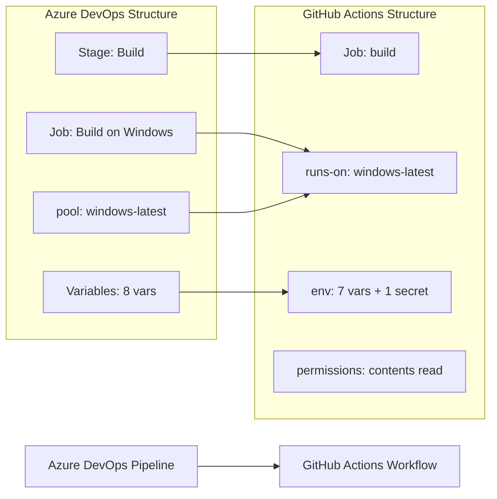

# 🚀 Azure DevOps to GitHub Actions Migration Report

## 📊 Migration Overview

| Metric          | Before (Azure DevOps)                     | After (GitHub Actions)                  |
| --------------- | ----------------------------------------- | --------------------------------------- |
| Pipeline Files  | 1 file (`tailwindtraders-build.yml`)      | 1 workflow                              |
| Pipeline Stages | 1 stage (Build)                           | 1 job (build)                           |
| Pipeline Jobs   | 1 job (Build on Windows), 11 steps        | 1 job, 11 steps                         |
| Templates       | None                                      | N/A                                     |

## 🔄 Conversion Diagram



## 🔧 Key Transformations

### Stage/Job Conversions

- Azure DevOps `stages:` with single stage → GitHub Actions single `job`
- Azure DevOps `pool: vmImage: windows-latest` → `runs-on: windows-latest`
- Azure DevOps `variables:` block → `env:` block at workflow level
- Azure DevOps `trigger: [main]` → `on: push: branches: [main]`

### Task and Variable Mappings

| Azure DevOps Task                     | GitHub Actions Equivalent                                             |
| ------------------------------------- | --------------------------------------------------------------------- |
| `NodeTool@0` (v10.16.3)               | `actions/setup-node@v6.4.0` with `node-version: "10.16.3"`           |
| `UseDotNet@2` (.NET 5.x SDK)          | `actions/setup-dotnet@v5.4.0` with `dotnet-version: "5.x"`           |
| `Npm@1` (npm install)                 | `run: npm install`                                                    |
| `DotNetCoreCLI@2` (restore)           | `run: dotnet restore`                                                 |
| `powershell:` (Generate AssemblyInfo) | `run:` with `shell: pwsh`                                             |
| `VersionAssemblies@2`                 | `run:` PowerShell with regex replace on `**/AssemblyInfo.cs`          |
| `DotNetCoreCLI@2` (build)             | `run: dotnet build`                                                   |
| `AdvancedSecurity-Dependency-Scanning@1` | GitHub GHAS native (Dependabot alerts + dependency graph)          |
| `AdvancedSecurity-Publish@1`          | GitHub GHAS native (automatic SARIF ingestion)                        |
| `DotNetCoreCLI@2` (test)              | `run: dotnet test`                                                    |
| `script:` (echo deployment secret)   | `run: echo` with `${{ secrets.PUBLISH_KEY }}`                        |

### Structural Changes

- Build version format `$(MajorVersion).$(MinorVersion).$(Rev:r)` converted to `$MAJOR.$MINOR.${{ github.run_number }}`
- `$(Build.SourcesDirectory)` → `${{ github.workspace }}`
- `$(Build.BuildNumber)` → constructed from `MAJOR_VERSION.MINOR_VERSION.github.run_number`
- Added `permissions: contents: read` for least-privilege security
- Added npm caching via `setup-node` built-in cache
- Added NuGet caching via `setup-dotnet` built-in cache

## ✅ Validation Results

### Linting Results

```
$ actionlint .github/workflows/tailwindtraders-build.yml
(no output — 0 errors, 0 warnings)
Exit code: 0
```

### Manual Verification Checklist

- [x] YAML syntax validated (actionlint: 0 errors)
- [x] All actions pinned to commit SHAs with version comments
- [x] Job dependencies verified (single job, no dependencies needed)
- [x] Environment variables migrated from `variables:` block
- [x] Secrets properly referenced (`${{ secrets.PUBLISH_KEY }}`)
- [x] Triggers match original behavior (`push: branches: [main]`)

## 🔐 Security Improvements

- Pinned all actions to commit SHAs to prevent supply-chain attacks
- Added `permissions: contents: read` for least-privilege `GITHUB_TOKEN` access
- Mapped `$(publishKey)` pipeline variable to `${{ secrets.PUBLISH_KEY }}` GitHub Secret
- Azure DevOps Advanced Security dependency scanning replaced by GitHub's native GHAS integration (Dependabot alerts enabled via repository settings — no explicit CI step required)

## 📈 Performance Enhancements

- Added npm dependency caching via `actions/setup-node` built-in `cache: "npm"` option
- Added NuGet package caching via `actions/setup-dotnet` built-in `cache: true` option
- Both caches reduce repeated downloads across workflow runs

## 🔗 Variable and Secret Requirements

### Required GitHub Secrets

| Secret Name  | Description                                          | Source                              |
| ------------ | ---------------------------------------------------- | ----------------------------------- |
| `PUBLISH_KEY` | Deployment publish key referenced in deployment step | Azure Pipelines `$(publishKey)` variable |

### Required GitHub Variables (repository or environment)

No GitHub Variables are required. The following pipeline variables were migrated to workflow-level `env:` entries:

| Variable           | Value                          | Notes                                              |
| ------------------ | ------------------------------ | -------------------------------------------------- |
| `BUILD_CONFIGURATION` | `Release`                   | Workflow env var                                   |
| `BUILD_PLATFORM`   | `any cpu`                      | Defined for reference; not used in build commands  |
| `RESTORE_BUILD_PROJECTS` | `**/*.csproj`            | Workflow env var                                   |
| `TEST_PROJECTS`    | `**/*[Tt]ests/*.csproj`        | Workflow env var                                   |
| `WEBAPP_NAME`      | `tailwind-github-demo`         | Workflow env var (use in deployment workflows)     |
| `MAJOR_VERSION`    | `2`                            | Workflow env var                                   |
| `MINOR_VERSION`    | `0`                            | Workflow env var                                   |

### GitHub Advanced Security (GHAS)

The original pipeline contained two GHAS-specific Azure DevOps tasks:

- `AdvancedSecurity-Dependency-Scanning@1` — scans NuGet/npm dependencies for vulnerabilities
- `AdvancedSecurity-Publish@1` — submits results to Azure DevOps Advanced Security dashboard

**GitHub equivalent**: These are handled natively by GitHub Advanced Security. Enable the following in repository **Settings → Security → Code security and analysis**:

- ✅ Dependency graph
- ✅ Dependabot alerts
- ✅ Dependabot security updates

For pull request-level dependency review, add a separate workflow using `actions/dependency-review-action`.

## 🎯 Next Steps

1. **Configure secret** `PUBLISH_KEY` in GitHub repository **Settings → Secrets and variables → Actions**
2. **Enable GHAS features** in repository **Settings → Security → Code security and analysis** (Dependabot alerts, dependency graph)
3. **Test the workflow** by pushing to `main` or triggering manually
4. **Monitor execution** in the GitHub Actions tab for any runtime issues
5. **Note**: Node.js 10.16.3 is end-of-life. Consider upgrading to a supported Node.js LTS version (18.x or 20.x) in a follow-up change
6. **Note**: .NET 5.x is end-of-life. Consider upgrading to a supported .NET version (8.x or 9.x) in a follow-up change

## 📁 Original Azure DevOps Files

The original Azure DevOps pipeline file has been moved to `.github/ci-archive/` for reference:

- `tailwindtraders-build.yml` → [`.github/ci-archive/tailwindtraders-build.yml`](.github/ci-archive/tailwindtraders-build.yml)

## 📚 Migration Notes

- **Build versioning**: Azure DevOps used the pipeline name template `$(MajorVersion).$(MinorVersion).$(Rev:r)` for build numbers. GitHub Actions uses `github.run_number` as a monotonically increasing counter per workflow. The version format `2.0.{run_number}` is functionally equivalent.
- **`resource-group` variable**: The variable `resource-group: "ghazdo-workshops"` was defined in the original pipeline but not used in any visible pipeline steps (likely for deployment targets). It has been omitted from the workflow env since it is not referenced in any step. Add it back if needed for deployment jobs.
- **GHAS tasks**: `AdvancedSecurity-Dependency-Scanning@1` and `AdvancedSecurity-Publish@1` are Azure DevOps-specific GHAS tasks with no direct GitHub Actions equivalent action. GitHub's native GHAS features provide the same capability automatically without a CI step.
- **`publishKey` secret**: The original `script: echo 'Deployment with secret $(publishKey)'` suggests this variable may be a pipeline secret variable. It has been mapped to `secrets.PUBLISH_KEY`. If it was a non-secret pipeline variable, it can be moved to a workflow `env:` entry instead.

---
*Migration completed by GitHub Copilot Azure DevOps Migration Agent*
