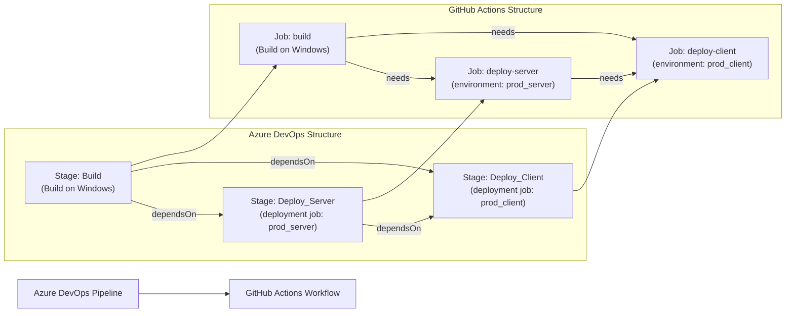

# 🚀 Azure DevOps to GitHub Actions Migration Report

## 📊 Migration Overview

| Metric          | Before (Azure DevOps)           | After (GitHub Actions)          |
| --------------- | ------------------------------- | ------------------------------- |
| Pipeline Files  | 1 file (`tailwindtraders-build.yml`) | 1 workflow (`.github/workflows/tailwindtraders-build.yml`) |
| Pipeline Stages | 3 stages (Build, Deploy_Server, Deploy_Client) | 3 jobs (build, deploy-server, deploy-client) |
| Pipeline Jobs   | 1 build job + 2 deployment jobs | 3 jobs / 12 steps               |
| Templates       | 0 templates                     | N/A                             |
| Runner Pool     | `windows-latest`                | `runs-on: windows-latest`       |

## 🔄 Conversion Diagram



## 🔧 Key Transformations

### Stage/Job Conversions

| Azure DevOps Concept                          | GitHub Actions Equivalent               |
| --------------------------------------------- | --------------------------------------- |
| `stages:` with `dependsOn:`                   | `jobs:` with `needs:`                   |
| `pool: vmImage: windows-latest`               | `runs-on: windows-latest`               |
| `trigger: [main]`                             | `on: push: branches: [main]`            |
| `deployment:` job with `environment:`         | `jobs:` with `environment:`             |
| `strategy: runOnce: deploy:`                  | Regular job steps (no special strategy) |
| `condition: succeeded()`                      | Default job behavior (implicit success) |
| Pipeline name `$(MajorVersion).$(MinorVersion).$(Rev:r)` | `Compute build version` step → `BUILD_VERSION` env var |

### Task Mappings

| Azure DevOps Task                              | GitHub Actions Equivalent                                         |
| ---------------------------------------------- | ----------------------------------------------------------------- |
| `NodeTool@0` (versionSpec: 10.16.3)            | `actions/setup-node@v6.4.0` (SHA-pinned)                         |
| `UseDotNet@2` (sdk, 5.x)                       | `actions/setup-dotnet@v5.4.0` (SHA-pinned)                       |
| `Npm@1` (workingDir: ClientApp)                | `run: npm install` with `working-directory:`                      |
| `DotNetCoreCLI@2` (restore)                    | `run: dotnet restore <solution>`                                   |
| `powershell:` (Generate AssemblyInfo.cs)       | `run:` with `shell: pwsh`                                         |
| `VersionAssemblies@2` (filePattern, threeParts)| `mingjun97/file-regex-replace@v1` (SHA-pinned)                    |
| `DotNetCoreCLI@2` (build)                      | `run: dotnet build <solution> --configuration`                    |
| `AdvancedSecurity-Dependency-Scanning@1`       | Handled by GitHub Advanced Security (native, no step required)    |
| `AdvancedSecurity-Publish@1`                   | Handled by GitHub Advanced Security (native, no step required)    |
| `DotNetCoreCLI@2` (test)                       | `run: dotnet test <solution> --configuration`                     |

### Variable Mappings

| Azure DevOps Variable                           | GitHub Actions Equivalent            | Type          |
| ----------------------------------------------- | ------------------------------------ | ------------- |
| `BuildConfiguration: Release`                   | `env.BUILD_CONFIGURATION: Release`   | env var       |
| `majorVersion: 2`                               | `env.MAJOR_VERSION: "2"`             | env var       |
| `minorVersion: 0`                               | `env.MINOR_VERSION: "0"`             | env var       |
| `$(Build.BuildNumber)` → `2.0.$(Rev:r)`         | `${{ env.BUILD_VERSION }}`           | computed env  |
| `$(publishKey)` (secret)                        | `${{ secrets.PUBLISH_KEY }}`         | GitHub Secret |
| `webapp_name: tailwind-github-demo`             | `vars.WEBAPP_NAME` (see next steps)  | GitHub Var    |
| `resource-group: "ghazdo-workshops"`            | `vars.RESOURCE_GROUP` (see next steps)| GitHub Var   |
| `BuildPlatform: "any cpu"`                      | Not needed (dotnet CLI default)       | removed       |
| `advancedsecurity.submittoadvancedsecurity`     | Managed by GHAS settings              | removed       |

### Structural Changes

- `**/*.csproj` glob patterns replaced with explicit solution file path (`TailwindTraders.Website/Source/Tailwind.Traders.Web.sln`) for reliable behavior on Windows PowerShell runners, where shell glob expansion is not performed
- `$(Rev:r)` auto-increment replaced with `${{ github.run_number }}` (global monotonic counter; does not reset when major/minor version changes — see Migration Notes)
- `AdvancedSecurity-Dependency-Scanning@1` / `AdvancedSecurity-Publish@1` have no direct workflow equivalent; GitHub Advanced Security handles this natively at the repository level
- All actions pinned to commit SHAs per security best practices

## ✅ Validation Results

### Linting Results

```
$ actionlint .github/workflows/tailwindtraders-build.yml
(no output)

Exit code: 0
```

**Result: PASSED — no syntax errors or warnings.**

### Manual Verification Checklist

- [x] YAML syntax validated with actionlint (exit 0, no errors)
- [x] All actions properly versioned and SHA-pinned
- [x] Job dependencies correctly defined (`needs: build`, `needs: [build, deploy-server]`)
- [x] Environment variables migrated (`BUILD_CONFIGURATION`, `MAJOR_VERSION`, `MINOR_VERSION`)
- [x] Secrets properly referenced (`${{ secrets.PUBLISH_KEY }}`)
- [x] Triggers match original behavior (`push: branches: [main]`)
- [x] Deployment environments preserved (`prod_server`, `prod_client`)
- [x] `condition: succeeded()` preserved as default job success gate

## 🔐 Security Improvements

- All actions pinned to commit SHAs (not floating tags) to prevent supply-chain attacks
- `${{ secrets.PUBLISH_KEY }}` used instead of inline variable interpolation for the deployment secret
- `permissions: contents: read` applied to all jobs following least-privilege model
- GitHub Advanced Security dependency scanning enabled at repository level replaces ADO Advanced Security tasks
- No credentials stored in workflow file or environment variables

## 📈 Performance Enhancements

- Build and test use the solution file directly, eliminating the overhead of glob expansion across the workspace
- Build and deploy stages are cleanly separated jobs with explicit `needs:` wiring, enabling GitHub Actions to display per-job timing and status
- Opportunity: add `actions/cache` for NuGet packages and npm to reduce restore times (not in original pipeline, flagged as future improvement)

## 🔗 Variable and Secret Requirements

### Required GitHub Secrets

| Secret Name   | Description                                          | Source in ADO              |
| ------------- | ---------------------------------------------------- | -------------------------- |
| `PUBLISH_KEY` | Deployment publish key used in server/client deploys | `$(publishKey)` pipeline variable |

### Required GitHub Variables (optional, for completeness)

| Variable Name    | Description                      | Value in ADO                   |
| ---------------- | -------------------------------- | ------------------------------ |
| `WEBAPP_NAME`    | Azure Web App name               | `tailwind-github-demo`          |
| `RESOURCE_GROUP` | Azure resource group             | `ghazdo-workshops`              |

> **Note:** `WEBAPP_NAME` and `RESOURCE_GROUP` are not used in any pipeline steps — they were defined in the original Azure DevOps pipeline variables section but never referenced in steps. They are documented here for completeness; configure as GitHub Variables if future steps require them.

### GitHub Environments

The following GitHub environments must be created with appropriate protection rules:

| Environment   | Equivalent ADO Environment | Suggested Protection |
| ------------- | -------------------------- | -------------------- |
| `prod_server` | `prod_server`              | Required reviewers, branch protection |
| `prod_client` | `prod_client`              | Required reviewers, branch protection |

## 🎯 Next Steps

1. **Configure `PUBLISH_KEY` secret** in repository Settings → Secrets → Actions
2. **Create GitHub environments** `prod_server` and `prod_client` in Settings → Environments with appropriate protection rules
3. **Enable GitHub Advanced Security** in Settings → Security & analysis to replace the ADO `AdvancedSecurity-Dependency-Scanning@1` / `AdvancedSecurity-Publish@1` tasks
4. **Test the workflow** by pushing to a feature branch (after relaxing the trigger) or merging to `main`
5. **Monitor execution** for any runtime issues, especially the npm install step which uses Node 10.16.3 (legacy)
6. **Consider upgrading** Node 10.16.3 and .NET 5.x to current LTS versions in a follow-up PR

## 📁 Original Azure DevOps Files

The original Azure DevOps pipeline file has been moved to `.github/ci-archive/` for reference:

- `tailwindtraders-build.yml` → [`.github/ci-archive/tailwindtraders-build.yml`](.github/ci-archive/tailwindtraders-build.yml)

## 📚 Migration Notes

### Build Version Counter Difference

The original pipeline used Azure DevOps's `$(Rev:r)` revision counter, which resets to `1` each time the pipeline name prefix (major.minor) changes. `github.run_number` is a global monotonic counter scoped to the workflow — it does not reset. This means build numbers will be higher and non-resetting. If a resetting counter is required, it must be implemented via a separate state-tracking mechanism (e.g., a repository variable or GitHub release tag).

### ADO Advanced Security Tasks

`AdvancedSecurity-Dependency-Scanning@1` and `AdvancedSecurity-Publish@1` are Azure DevOps Advanced Security tasks that scan NuGet/npm dependencies and publish SARIF results to ADO. On GitHub, this is handled natively by GitHub Advanced Security (GHAS) without needing explicit workflow steps. GHAS dependency scanning, secret scanning, and CodeQL can all be enabled from the repository's Security & analysis settings.

### Glob Pattern Handling on Windows

The original pipeline used `**/*.csproj` and `**/*[Tt]ests/*.csproj` as project glob patterns in `DotNetCoreCLI@2` tasks. These were expanded internally by the ADO task runner. PowerShell on Windows does not expand glob patterns before passing them to executables, so the workflow uses the solution file path (`TailwindTraders.Website/Source/Tailwind.Traders.Web.sln`) directly for all `dotnet` CLI invocations, which is more reliable and idiomatic.

---
*Migration completed by GitHub Copilot Azure DevOps Migration Agent*
