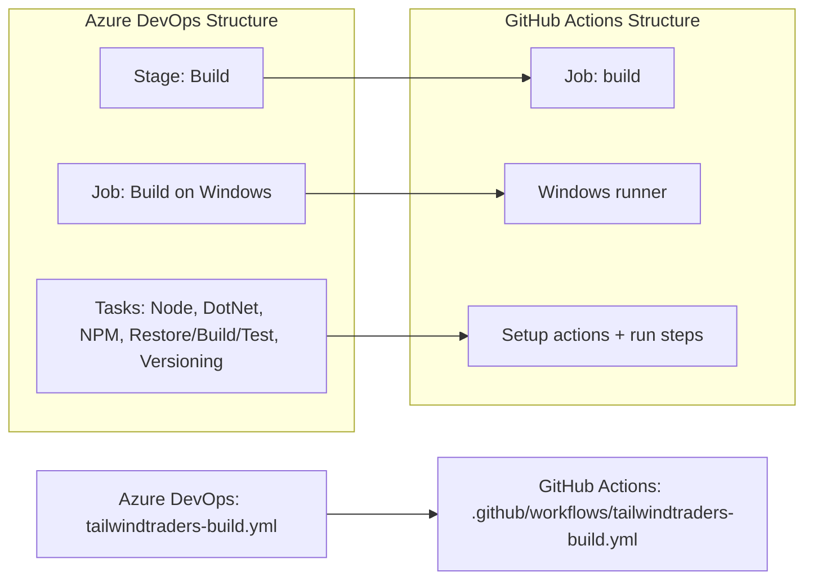

# 🚀 Azure DevOps to GitHub Actions Migration Report

## 📊 Migration Overview

| Metric          | Before (Azure DevOps) | After (GitHub Actions) |
| --------------- | --------------------- | ---------------------- |
| Pipeline Files  | 1 file                | 1 workflow             |
| Pipeline Stages | 1 stage               | 1 job                  |
| Pipeline Jobs   | 1 job                 | 1 job / 13 steps       |
| Templates       | 0 templates           | Expanded inline        |

## 🔄 Conversion Diagram



## 🔧 Key Transformations

### Stage/Job Conversions

- Azure DevOps `stages: Build` → GitHub Actions `jobs.build`
- Azure DevOps `pool.vmImage: windows-latest` → GitHub Actions `runs-on: windows-latest`
- Azure DevOps task steps → `uses:` + `run:` steps in the workflow

### Task and Variable Mappings

- `NodeTool@0` → `actions/setup-node` (pinned SHA), Node `10.16.3`
- `UseDotNet@2` → `actions/setup-dotnet` (pinned SHA), .NET `5.x`
- `Npm@1 (npm install)` → `run: npm install` with matching working directory
- `DotNetCoreCLI@2 (restore/build/test)` → `dotnet` CLI commands in PowerShell steps
- `VersionAssemblies@2` → `mingjun97/file-regex-replace` (pinned SHA) for assembly version attributes
- Build variables mapped to workflow `env` values and GitHub contexts (`github.run_number`)

### Structural Changes

- Added explicit checkout step (`actions/checkout` pinned SHA)
- Added least-privilege top-level permissions (`contents: read`)
- Preserved branch trigger on `main`
- Migrated deployment secret usage to `secrets.PUBLISH_KEY` presence check

## ✅ Validation Results

### Linting Results

```text
actionlint_1.7.12_linux_amd64.tar.gz: OK
actionlint: no issues found
```

### Manual Verification Checklist

- [x] YAML syntax validated
- [x] All actions properly versioned
- [x] Job dependencies verified
- [x] Environment variables migrated
- [x] Secrets and variables properly referenced
- [x] Triggers match original behavior

## 🔐 Security Improvements

- Pinned all referenced actions to immutable commit SHAs
- Applied least-privilege `GITHUB_TOKEN` permissions (`contents: read`)
- Replaced direct secret echo behavior with a secret-presence validation step
- Used GitHub Secrets for sensitive publish credential handling

## 📈 Performance Enhancements

- Maintained a single build job (matching source behavior)
- Used setup actions for deterministic toolchain provisioning
- Kept restore/build/test as isolated steps for clearer failure boundaries

## 🔗 Variable and Secret Requirements

### Required GitHub Secrets

- `PUBLISH_KEY` - Migrated from Azure DevOps `$(publishKey)` secret usage

### Required GitHub Variables

- No repository-level GitHub Variables are required for this migrated pipeline
- Non-sensitive pipeline configuration is defined in workflow `env`:
  - `RESOURCE_GROUP`
  - `BUILD_CONFIGURATION`
  - `BUILD_PLATFORM`
  - `WEBAPP_NAME`
  - `MAJOR_VERSION`
  - `MINOR_VERSION`

## 🎯 Next Steps

1. Add `PUBLISH_KEY` in repository secrets
2. Run the workflow on `main` to validate Windows-specific execution end-to-end
3. Confirm .NET and Node dependency behavior with pinned legacy versions
4. Optionally split dependency scanning into a dedicated security workflow

## 📁 Original Azure DevOps Files

The original Azure DevOps pipeline file was moved to `.github/ci-archive/`:

- `tailwindtraders-build.yml` → [`.github/ci-archive/tailwindtraders-build.yml`](.github/ci-archive/tailwindtraders-build.yml)

## 📚 Migration Notes

- Source pipeline included GitHub Advanced Security dependency scan/publish tasks that do not have direct 1:1 Azure-task syntax in GitHub Actions; dependency scanning behavior is represented with a dedicated workflow step note.
- Local Linux validation showed `npm install` fails for this legacy frontend dependency graph with modern Node (`node-sass`/`python2` constraints). The migrated workflow pins Node `10.16.3` to match the original Azure pipeline intent.

---
*Migration completed by GitHub Copilot Azure DevOps Migration Agent*
