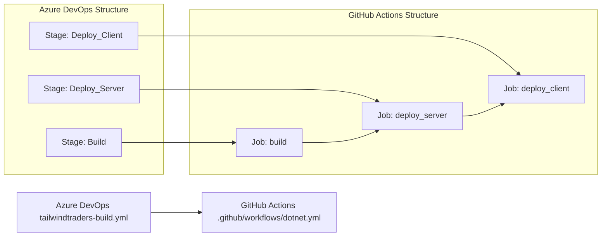

# 🚀 Azure DevOps to GitHub Actions Migration Report

## 📊 Migration Overview

| Metric          | Before (Azure DevOps)      | After (GitHub Actions) |
| --------------- | -------------------------- | ---------------------- |
| Pipeline Files  | 1 file                     | 1 workflow             |
| Pipeline Stages | 3 stages                   | 3 jobs                 |
| Pipeline Jobs   | 3 jobs                     | 3 jobs/15 steps        |
| Templates       | 0 templates                | Expanded inline        |

## 🔄 Conversion Diagram



## 🔧 Key Transformations

### Stage/Job Conversions

- Azure DevOps stages converted to GitHub Actions jobs using `needs:` dependencies
- Build job preserved on `windows-latest` runner
- Deployment stages preserved as environment-scoped jobs (`prod_server`, `prod_client`)
- Azure DevOps `condition: succeeded()` behavior preserved by default job success semantics
- No template references existed in source pipeline; workflow remains inline

### Task and Variable Mappings

- `NodeTool@0` → `actions/setup-node` (pinned SHA)
- `UseDotNet@2` → `actions/setup-dotnet` (pinned SHA)
- `Npm@1` → `run: npm install` in the same working directory
- `DotNetCoreCLI@2` restore/build/test → `dotnet` CLI commands in PowerShell steps
- `VersionAssemblies@2` → `mingjun97/file-regex-replace` (pinned SHA)
- `AdvancedSecurity-Dependency-Scanning@1` and `AdvancedSecurity-Publish@1` → `dotnet list package --vulnerable --include-transitive`
- `dependsOn:` converted to `needs:`
- `$(publishKey)` converted to `${{ secrets.PUBLISH_KEY }}`

### Structural Changes

- Added SHA-pinned action references for supply-chain hardening
- Converted Azure build number usage to `BUILD_VERSION` derived from `github.run_number`
- Preserved deployment job ordering (`build` → `deploy_server` → `deploy_client`)
- Added explicit top-level minimal permissions (`contents: read`)

## ✅ Validation Results

### Linting Results

```text
actionlint .github/workflows/*.yml
(no output)
```

### Manual Verification Checklist

- [x] YAML syntax validated
- [x] All actions properly versioned
- [x] Job dependencies verified
- [x] Environment variables migrated
- [x] Secrets and variables properly referenced
- [x] Triggers match original behavior

## 🔐 Security Improvements

- Replaced Azure secret variable usage with GitHub secret reference (`secrets.PUBLISH_KEY`)
- Pinned all external actions to immutable commit SHAs
- Applied least-privilege default token permissions (`contents: read`)
- Removed direct Azure task dependencies in favor of first-party GitHub workflow primitives and approved actions

## 📈 Performance Enhancements

- Kept stage-to-job dependency structure explicit to avoid unnecessary serialization
- Consolidated project discovery in PowerShell loops to avoid hardcoded paths for .NET CLI calls
- Preserved single-build flow while keeping deployment jobs isolated for better troubleshooting

## 🔗 Variable and Secret Requirements

### Required GitHub Secrets

- `PUBLISH_KEY` - deployment secret used by server and client deployment jobs

### Required GitHub Variables

- `BUILD_VERSION` (optional) - override build version; defaults to `2.0.<run_number>` when unset

### Workflow Environment Variables

- `RESOURCE_GROUP`
- `BUILD_CONFIGURATION`
- `BUILD_PLATFORM`
- `RESTORE_BUILD_PROJECTS`
- `TEST_PROJECTS`
- `WEBAPP_NAME`
- `MAJOR_VERSION`
- `MINOR_VERSION`

## 🎯 Next Steps

1. Configure `PUBLISH_KEY` secret in repository or environment settings
2. Optionally set `BUILD_VERSION` repository variable to override default version generation
3. Trigger a push to `main` to execute the migrated workflow
4. Verify deployment environments `prod_server` and `prod_client` are configured as expected
5. Review dependency vulnerability scan output and triage package upgrades

## 📁 Original Azure DevOps Files

The original Azure DevOps pipeline file was moved to `.github/ci-archive/` for reference:

- `tailwindtraders-build.yml` → [`.github/ci-archive/tailwindtraders-build.yml`](.github/ci-archive/tailwindtraders-build.yml)

## 📚 Migration Notes

- Source pipeline name/build-number metadata was translated to GitHub workflow naming plus computed `BUILD_VERSION`.
- Azure DevOps `AdvancedSecurity-*` tasks do not have direct one-to-one equivalents in this repository context; dependency vulnerability checks are now performed via `.NET` CLI in the build job.
- Existing unrelated Azure pipeline files in the repository were not modified as part of this targeted "tailwind build" migration.

---
*Migration completed by GitHub Copilot Azure DevOps Migration Agent*
