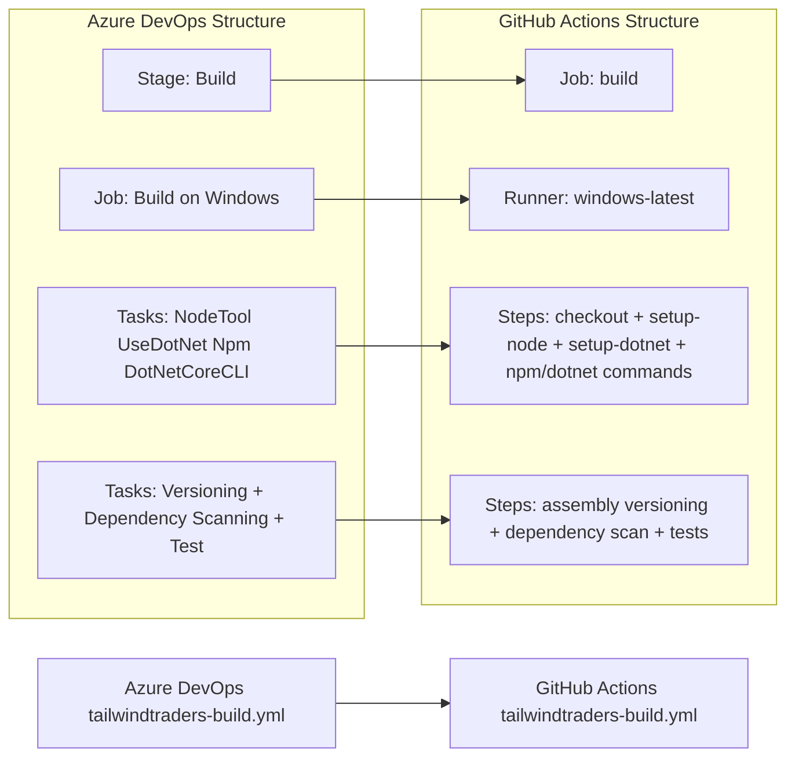

# 🚀 Azure DevOps to GitHub Actions Migration Report

## 📊 Migration Overview

| Metric | Before (Azure DevOps) | After (GitHub Actions) |
| --------------- | --------------------- | ---------------------- |
| Pipeline Files  | 1 file (`tailwindtraders-build.yml`) | 1 workflow (`.github/workflows/tailwindtraders-build.yml`) |
| Pipeline Stages | 1 stage (`Build`) | 1 job (`build`) |
| Pipeline Jobs   | 1 job | 1 job / 13 steps |
| Templates       | 0 templates | Expanded inline (N/A) |

## 🔄 Conversion Diagram



## 🔧 Key Transformations

### Stage/Job Conversions

- Azure DevOps `stages`/`jobs` converted to a single GitHub Actions `jobs.build`
- Azure DevOps `pool.vmImage: windows-latest` converted to `runs-on: windows-latest`
- Azure DevOps tasks converted to equivalent GitHub Actions steps
- Assembly version generation/version replacement implemented in PowerShell steps

### Task and Variable Mappings

- `NodeTool@0` → `actions/setup-node` (pinned to commit SHA)
- `UseDotNet@2` → `actions/setup-dotnet` (pinned to commit SHA)
- `Npm@1` → `run: npm install`
- `DotNetCoreCLI@2` restore/build/test → `dotnet restore/build/test` commands
- `VersionAssemblies@2` → PowerShell-based AssemblyInfo replacement step
- `AdvancedSecurity-Dependency-Scanning@1`/`AdvancedSecurity-Publish@1` → .NET and npm dependency scan command steps with published log output
- Azure DevOps variables (`BuildConfiguration`, project globs, version parts) → workflow-level `env`

### Structural Changes

- Added SHA-pinned verified GitHub actions (`actions/checkout`, `actions/setup-node`, `actions/setup-dotnet`)
- Converted Azure build number semantics to `MAJOR_VERSION.MINOR_VERSION.github.run_number`
- Preserved secret usage behavior via `secrets.PUBLISH_KEY`
- Added least-privilege workflow permissions (`contents: read`)

## ✅ Validation Results

### Linting Results

```text
actionlint .github/workflows/tailwindtraders-build.yml
(no output)
```

### Manual Verification Checklist

- [x] YAML syntax validated
- [x] All actions properly versioned
- [x] Job dependencies verified
- [x] Environment variables migrated
- [x] Secrets and variables properly referenced
- [x] Triggers match original behavior

## 🔐 Security Improvements

- Replaced Azure pipeline secret reference `$(publishKey)` with GitHub Actions `secrets.PUBLISH_KEY`
- Applied least-privilege `GITHUB_TOKEN` permissions
- Pinned third-party action references to immutable commit SHAs
- Kept sensitive values out of workflow source and command output

## 📈 Performance Enhancements

- Kept a single Windows job to match original execution order and avoid behavior drift
- Used native setup actions for deterministic toolchain setup
- Preserved restore/build/test sequencing to maintain existing pipeline semantics

## 🔗 Variable and Secret Requirements

### Required GitHub Secrets

- `PUBLISH_KEY` - Secret used by deployment placeholder step

### Required GitHub Variables

No repository/organization-level GitHub Variables are strictly required; all non-sensitive values are defined in workflow `env`.

## 🎯 Next Steps

1. Configure `PUBLISH_KEY` in repository or environment secrets
2. Run the workflow on a branch push and verify Node 10/.NET 5 toolchain behavior on hosted runners
3. Review and remediate dependency vulnerability findings surfaced by .NET and npm scan steps
4. Optionally modernize dependencies/framework versions to reduce vulnerability and EOL warnings

## 📁 Original Azure DevOps Files

The original Azure DevOps pipeline file has been moved to `.github/ci-archive/` for reference:

- `tailwindtraders-build.yml` → [`.github/ci-archive/tailwindtraders-build.yml`](.github/ci-archive/tailwindtraders-build.yml)

## 📚 Migration Notes

- Source pipeline contained one stage/job and no external templates; migration was direct.
- Post-migration local validation (`dotnet build`) still reports existing upstream dependency vulnerability warnings and .NET 5 EOL warnings from the project itself.
- No additional source CI files were changed in this migration.

---
*Migration completed by GitHub Copilot Azure DevOps Migration Agent*
