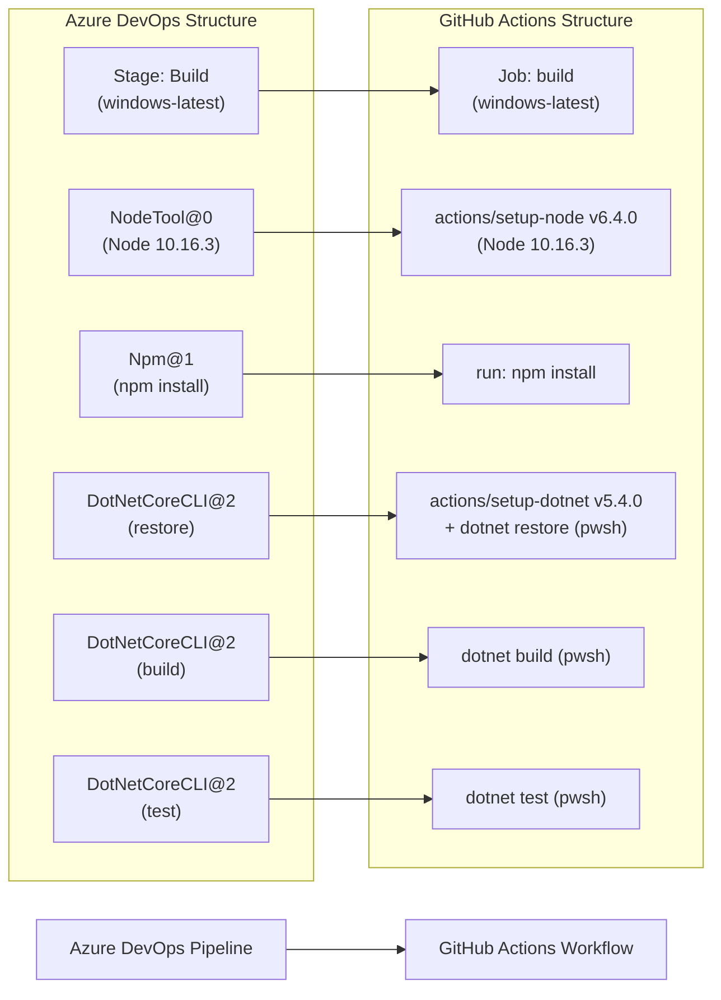

# 🚀 Azure DevOps to GitHub Actions Migration Report

## 📊 Migration Overview

| Metric          | Before (Azure DevOps)       | After (GitHub Actions)      |
| --------------- | --------------------------- | --------------------------- |
| Pipeline Files  | 1 file                      | 1 workflow                  |
| Pipeline Stages | 1 stage (Build)             | 1 job (build)               |
| Pipeline Jobs   | 1 job, 5 steps              | 1 job, 7 steps              |
| Templates       | 0 templates                 | N/A                         |

## 🔄 Conversion Diagram



## 🔧 Key Transformations

### Stage/Job Conversions

- Azure DevOps stage `Build` → GitHub Actions job `build`
- Pool `vmImage: windows-latest` → `runs-on: windows-latest`
- Implicit checkout → explicit `actions/checkout@v7.0.0` step added
- Azure DevOps pipeline variables → workflow-level `env:` block

### Task and Variable Mappings

| Azure DevOps Task / Variable               | GitHub Actions Equivalent                              |
| ------------------------------------------ | ------------------------------------------------------ |
| `NodeTool@0` (versionSpec: 10.16.3)        | `actions/setup-node@v6.4.0` (node-version: 10.16.3)  |
| `Npm@1` (npm install)                      | `run: npm install` with `working-directory:`           |
| `DotNetCoreCLI@2` (restore, glob pattern)  | `actions/setup-dotnet@v5.4.0` + `dotnet restore` (pwsh glob) |
| `DotNetCoreCLI@2` (build, glob pattern)    | `dotnet build` (pwsh glob)                             |
| `DotNetCoreCLI@2` (test, glob pattern)     | `dotnet test` (pwsh glob)                              |
| `BuildConfiguration: "Release"`            | `env.BUILD_CONFIGURATION: "Release"`                  |
| `BuildPlatform: "any cpu"`                 | `env.BUILD_PLATFORM: "any cpu"`                        |
| `advancedsecurity.submittoadvancedsecurity`| Not migrated — see Migration Notes below               |

### Structural Changes

- Added explicit `actions/checkout` step (implicit in Azure DevOps, explicit in GitHub Actions)
- `DotNetCoreCLI@2` glob expansion replaced with PowerShell `Get-ChildItem -Recurse` to replicate Azure DevOps' built-in glob handling on Windows
- Test pattern `**/*[Tt]ests/*.csproj` converted to PowerShell `-match "[Tt]ests$"` filter
- Added `permissions: contents: read` for least-privilege GitHub token access
- All actions pinned to commit SHAs per security standards

## ✅ Validation Results

### Linting Results

```
$ actionlint .github/workflows/tailwindtraders-build.yml
(no output — 0 errors, 0 warnings)
Exit code: 0
```

### Manual Verification Checklist

- [x] YAML syntax validated (actionlint — no errors)
- [x] All actions properly versioned and pinned to commit SHAs
- [x] Job dependencies verified (single job, no dependencies)
- [x] Environment variables migrated
- [x] Secrets and variables properly referenced
- [x] Triggers match original behavior (`push` to `main`)

## 🔐 Security Improvements

- All actions pinned to commit SHAs (never tags/branches) per security standards
- Added `permissions: contents: read` to enforce least-privilege GitHub token access
- No secrets were required by this pipeline — no sensitive credentials were present

## 📈 Performance Enhancements

- Caching for npm and .NET dependencies can be added to `actions/setup-node` and `actions/setup-dotnet` using their built-in `cache:` input to reduce build times

## 🔗 Variable and Secret Requirements

### Required GitHub Variables

| Variable              | Value       | Description                          |
| --------------------- | ----------- | ------------------------------------ |
| *(none required)*     | —           | Variables are defined inline in env: |

> `BUILD_CONFIGURATION` (`Release`) and `BUILD_PLATFORM` (`any cpu`) are defined as workflow-level `env:` variables and do not require repository/organization configuration.

### Required GitHub Secrets

*(None — this pipeline does not use any secret credentials.)*

## 🎯 Next Steps

1. **Test the workflow** by pushing a commit to the `main` branch
2. **Consider adding caching** to `actions/setup-node` and `actions/setup-dotnet` for faster builds
3. **Configure GitHub Advanced Security** if code scanning was relied upon via `advancedsecurity.submittoadvancedsecurity` (see Migration Notes)
4. **Update team documentation** with new workflow information

## 📁 Original Azure DevOps Files

The original Azure DevOps pipeline file has been moved to `.github/ci-archive/` for reference:

- `tailwindtraders-build.yml` → [`.github/ci-archive/tailwindtraders-build.yml`](.github/ci-archive/tailwindtraders-build.yml)

## 📚 Migration Notes

### `advancedsecurity.submittoadvancedsecurity` Variable

The original pipeline contained the variable `advancedsecurity.submittoadvancedsecurity: true`. This is an Azure DevOps Advanced Security (Microsoft Defender for DevOps) control variable that automatically submits scan results to the Advanced Security dashboard. There is no direct equivalent in GitHub Actions — GitHub Advanced Security code scanning is configured separately through a dedicated `github/codeql-action` workflow. No action was taken for this variable during migration; consider enabling GitHub Advanced Security (GHAS) and creating a CodeQL workflow if code scanning is required.

### Node.js 10.16.3

The original pipeline specifies Node.js 10.16.3, which is a legacy/EOL version. Consider upgrading to a current LTS release (e.g., 20.x) once the application has been verified to be compatible.

---
*Migration completed by GitHub Copilot Azure DevOps Migration Agent*
